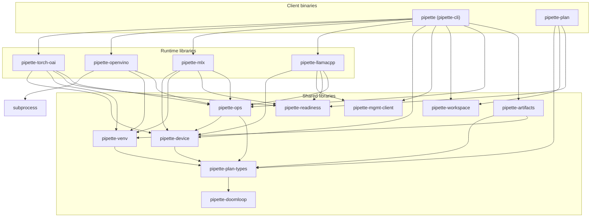

# Architecture

## Benchmark vs run vs execute

Use these words with one meaning each:

| Term | Meaning | Examples |
|------|---------|----------|
| **Benchmark** | Catalog/plan definition of *what* is measured (id, type, parameters, samples) | `BenchmarkDefinition`, workspace `benchmarks/`, `pipette benchmarks list` |
| **Run** | One cell lifecycle: prepare → engine → response → record/submit | `RunRequest`, `pipette_*::run`, CLI `run_cell` / `benchmarks run`, `RunResponse` |
| **`execute/`** | Engine module of per-`BenchmarkType` implementations (not CLI, not prepare) | `prefill_throughput.rs`, `eval.rs` under each runtime crate |

Flow:

```text
benchmarks run | worker claim
        │
        ▼
   run_cell(spec)          # CLI: prepare + dispatch
        │
        ▼
   RunRequest              # plan-types: portable cell (+ bound paths)
        │
        ▼
   engine run(req, …)      # public entry (re-export of execute::run)
        │
        ▼
   execute/<type>.rs       # measurement implementation
        │
        ▼
   RunResponse             # plan-types: metrics, streams, resolved flags
        │
        ▼
   finish_local / submit   # CLI record path
```

Prefer “**run** this benchmark” over “execute a benchmark.” Keep the directory
name `execute/`; do not rename it to `run/` (collides with the entry function)
or `bench/` (collides with the benchmark noun).

## Crates

| Crate | Role |
|-------|------|
| `pipette-workspace`   | Generic workspace lifecycle (init, open, manifest) |
| `pipette-ops`         | What the engines share but the contract doesn't: the injected `ReadinessGate`, eval checkpoints, and the prompt-seed / e2e-latency measurement kernels |
| `pipette-device`      | Host identity, power, and thermal probes (`DeviceInfo`, `detect_thermal`); the thermal shapes they fill live in `pipette-plan-types` |
| `pipette-artifacts`   | Model / runtime artifact cache: storage keys, manifests, atomic stage/publish, fetch + install |
| `pipette-readiness`   | Pre-benchmark readiness wait (`wait_until_ready`), one probe per platform |
| `pipette-venv`        | uv-provisioned Python venvs for vLLM, SGLang, desktop MLX, and OpenVINO |
| `pipette-subprocess`  | Process plumbing: describing external commands, `PATH` lookup, `SIGPIPE` reset, ^C teardown of spawned children |
| `pipette-http`        | Shared HTTP client configuration for GitHub, Hugging Face, and management-server calls |
| `pipette-memprobe-metal` | macOS Metal memory probe used by Apple runtime measurements |
| `pipette-mgmt-client` | HTTP client for the management server |
| `pipette-plan-types`  | Typed model/runtime matrix definitions shared by the runners and the plan orchestrator, plus the run contract (`run::RunRequest` / `run::RunResponse`) the mobile clients mirror |
| `pipette-doomloop`    | Repetition detection algorithm |
| `pipette-plan`        | Unified plan orchestrator CLI for typed model/runtime matrices |
| `pipette-cli`         | The unified `pipette` client binary (bundles the runtime libraries below); includes the planner claim loop (`pipette worker`) |
| `pipette-llamacpp`    | llama.cpp runner (library) |
| `pipette-mlx`         | MLX runner (library) |
| `pipette-openvino`    | OpenVINO GenAI runner for IR models on Intel CPU / GPU / NPU |
| `pipette-torch-oai`   | OpenAI-compatible runner (library) for PyTorch/HuggingFace models served by Docker or uv runtimes (vLLM, SGLang) |

## Dependency graph

Arrows point from a crate to the crates it depends on.



(Some direct runtime-library edges to `pipette-plan-types` and
`pipette-doomloop` are omitted for readability, as are leaf helper crates
`pipette-http` and `pipette-memprobe-metal`.)

The `pipette` client (`pipette-cli`) links the runtime libraries into one
binary. `pipette-plan` is a single binary that loads typed model/runtime
matrices from
`pipette-plan-types`. It has no compile-time dependency on `pipette`. It
invokes the `pipette` binary over ADB/SSH/local.

## Workspace

Each binary gets its own dot-prefixed directory:

| Directory | Binary |
|-----------|--------|
| `.pipette/`      | `pipette` client |
| `.pipette-plan/` | plan orchestrator |

Created by `<binary> init`. Required before any other command. See
[usage guide](pipette-cli/usage.md) for the full walkthrough.

Working directory resolution:

| Priority | Source |
|----------|--------|
| 1 | `--work-dir <path>` flag |
| 2 | `PIPETTE_WORK_DIR` env var |
| 3 | current directory |

The storage root is `<work-dir>/.<marker-name>/`.

## Stores

Each store is a concrete handle over one workspace subdirectory; no trait
indirection. They split by audience:

| Store | Crate | Holds |
|-------|-------|-------|
| `RuntimeArtifactStore` | `pipette-artifacts` | installed runtimes |
| `ModelArtifactStore`   | `pipette-artifacts` | fetched models |
| `EvalCompletionsStore` | `pipette-ops` | run / checkpoint state |
| `BenchmarkStore`       | `pipette-cli` | benchmark definitions |
| `ResultsStore`         | `pipette-cli` | benchmark results |
| `IdentityStore`        | `pipette-cli` | identity keys and registration |

The artifact and eval-completion stores are shared with the runtime libraries,
which run benchmarks without ever talking to the management server: each of
them takes an `EvalCompletionsStore` borrow, and none of them opens an artifact
store; the client resolves models and runtimes up front and hands the engines
bound paths. `BenchmarkStore`, `ResultsStore` and `IdentityStore` exist only
for the client, alongside the flows that register, sync, and submit on top of
them (`pipette_cli::client`).

`pipette_cli::workspace::PipetteWorkspace` mints every store above from the
workspace root.

## Secrets

Two values in this workspace are secret: a HuggingFace access token
(`pipette_plan_types::AuthToken`, carried in the plan for a gated repo) and a
pre-auth registration key (`pipette_mgmt_client::types::PreauthKey`). Both are
newtypes, and the trait set of a secret newtype is fixed:

| Trait | Rule | Why |
|-------|------|-----|
| `Debug` | hand-write → `TypeName(<redacted>)` | Never `derive`. Every struct holding one derives `Debug` and dumps through it, so the redaction has to sit at the leaf. |
| `Display` | hand-write → `<redacted>` | `{}` must compile *and* be safe. If it didn't compile, an author needing `{}` would reach for `as_ref()` and print the raw value instead. |
| `AsRef<str>` | the only door to the raw value | One named way out ⇒ auditing a secret is a search for its `as_ref` call sites. |
| `Deref`, `Into<String>`, `ToString` | must not exist | Each re-exposes the raw value implicitly. (`ToString` follows from `Display`, hence the redacting `Display` above.) |
| `Serialize` / `Deserialize` | allowed, and load-bearing | Plans and claim payloads carry these values inline. This is what makes serde (not the rendering traits) the real leak vector. |

A type that merely *contains* a secret derives `Debug` (inheriting the leaf's
redaction) and renders identity only in `Display`: `HfRepo` prints
`org/repo_name`, `Model` prints `source.reference()`, and both deliberately
exclude the token.

Because the leaf serializes, every boundary that persists, submits, or prints a
structure strips the secret explicitly:

| Boundary | Mechanism |
|----------|-----------|
| submitted result descriptor, `models` output, store manifests | `Model::without_auth_token()` |
| an untyped claim payload (no leaf to carry redaction) | `pipette_cli::client::claim::redacted_spec` |
| a `Debug` dump; e.g. `dispatch: {req:?}` in `pipette_cli::run` | the leaf's own `Debug` |

Enforcement: `ci/checks/secret-newtypes.py` rejects a secret-named field that
isn't one of these types, and rejects a secret newtype that derives a rendering
trait instead of hand-writing it. `pipette_plan_types::run`'s
`debug_redacts_the_model_auth_token` pins the dump for every model shape that
can carry a token.

## Runner CLI layout

After `pipette init`:

```
.pipette/
  manifest.toml
  identity/
  runtimes/
  models/
  benchmarks/
    local/
    remote/
  results/
    local/
    remote/
      pending/
      synced/
  state/
    evals/         # resumable eval checkpoints
```

The `models/` store is shared across backends (fetched once, reused). MLX hands
the materialized directory to the `mlx-lm` server; torch-oai Docker bind-mounts
it at `/models/model`, while torch-oai uv passes the host path into the server
process. `runtimes/` is the common root for installs: every runtime is
published through the shared artifact store as `<key>/manifest.toml` plus a
`blobs/` payload, and each installer owns what lands in `blobs/`; an extracted
archive for llama.cpp, a uv-provisioned venv for MLX and torch-oai uv, nothing
for Docker, whose image the daemon holds. For torch-oai Docker the container
lifecycle is in-process (bounded
by a single `benchmarks run`), so nothing is persisted under `state/server/`.

`init` creates the directory tree and a `manifest.toml` marker (a legacy
`manifest.json` is migrated to TOML on open). All other files are created by
the commands that need them.

## Plan CLI layout

After `pipette-plan init`:

```
.pipette-plan/
  manifest.toml
  plans/
    {plan_id}/
      state.jsonl
```

Layout is backend-agnostic: `plan_id` in each plan TOML is unique, so
there's no collision risk between plans. The CLI tracks execution state
only; it does not manage identity, runtimes, models, benchmarks, or
results (those live in the remote binary's own workspace).

## Plan TOML

Plan runners read a TOML file that defines the benchmark matrix:

```toml
plan_id = "android-all-remote-v1"
benchmarks = ["prefill_throughput_512"]

[[transports]]
client_id   = "android-a"
type        = "adb"
serial      = "R5CY80M8ZZK"
binary_path = "/data/local/tmp/edge-evals/pipette"
work_dir    = "/data/local/tmp/edge-evals"
shell       = "posix"

[[variants]]
clients = ["android-a"]
models = [
  { type = "gguf_text", source = "huggingface", org = "LiquidAI", repo_name = "LFM2.5-350M-GGUF", path = "LFM2.5-350M-Q4_K_M.gguf" },
]
runtimes = [
  { type = "llamacpp_cli_stock_tools", repository_version = "23dff81c4", flavor = "android-arm64-v8a" },
]
```

The root `benchmarks` list is the default for all variants. A variant
can set its own `benchmarks` list to override the root, and the root
list can be omitted when every variant supplies one. Model/runtime
compatibility is validated up front: GGUF pairs with the llama.cpp
runtimes (`llamacpp_cli_stock_tools`, `llamacpp_apk_pipette`), MLX pairs
with `mlx_macos_pipette` / `mlx_ios_pipette`, and Torch/HF pairs with
Docker or uv OpenAI-compatible runtimes, and OpenVINO IR (`openvino`) pairs
with `uv_openvino`.

`binary_path` and `work_dir` are per-transport: different targets can
have the binary installed at different paths. The plan runner passes
`--work-dir` to the remote binary. The remote binary finds its own
`.pipette/` workspace under that directory.

See [`examples/plans/`](../examples/plans/) for minimal working plans
per runner.

## Remote devices

Install scripts deploy the binary and run `init`:

```bash
pipette --work-dir /data/local/tmp/edge-evals init
```

This creates `.pipette/` on the device. The plan runner
orchestrates remote benchmark execution via ADB or SSH.
