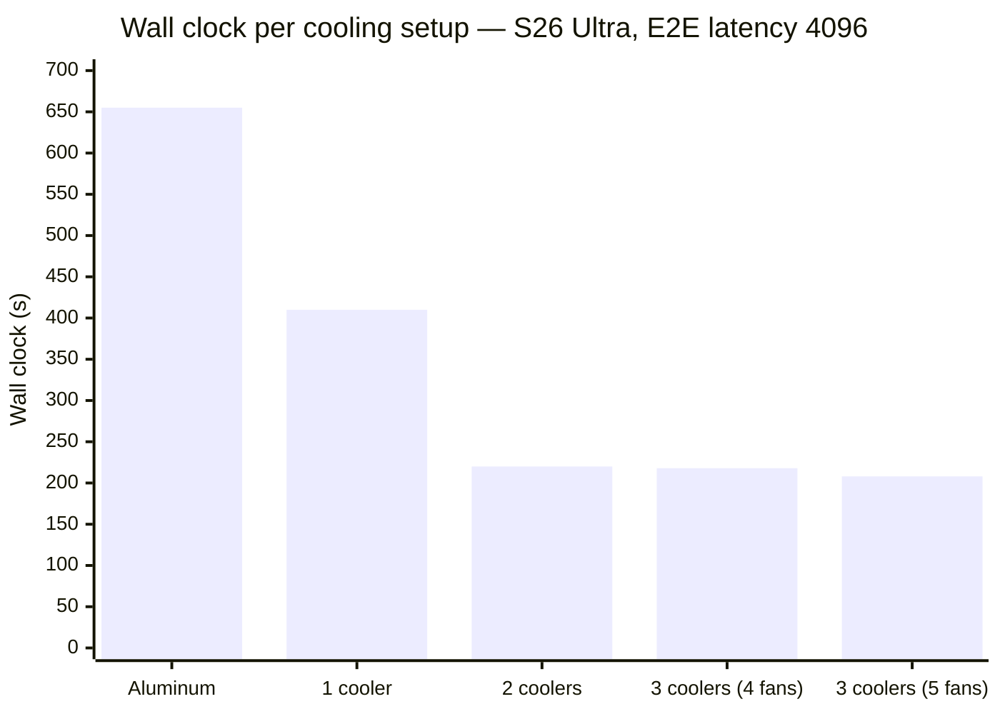

# Device Conditions

Timing benchmarks measure how fast a model runs, so they are only meaningful when
the device is in a known, comparable state. Two things define that state: what the
device is doing when measurement starts (its temperature and how busy it is), and
how the test rig is set up around it, namely power and cooling. This article
describes the conditions every measured device is held to, what is checked
automatically versus arranged by hand, and the specifics per platform we measure
on. The per-metric articles describe how each number is then measured; this one
describes the environment it is measured in.

## Overall expectations

Before a timed measurement starts, a device is expected to be:

- **Cool.** Below a platform-specific temperature band, so the measured work
  starts with thermal budget rather than part-way into throttling. This is
  enforced by the readiness gate (see
  [End-to-end latency → System Readiness Control](end-to-end-latency.md#system-readiness-control)
  for the full per-platform criteria and the reasoning behind each threshold).
- **Idle.** Not already busy with other work: no second benchmark, no heavy
  background process. Enforced by the same gate's CPU, and where present GPU,
  load signal.
- **On external power.** Phones and tablets run on mains power, never on battery,
  with a charger sized above the chip's sustained draw so inference is never
  power- or charge-limited and a draining battery never skews timing. Dedicated
  hosts are wired to AC.
- **Actively cooled.** Phones run clamped between two powered coolers; the
  fanless MacBook Neo carries a passive pad inside the case plus one active pad
  under it (see [Active cooling](#active-cooling)). Unlike a passive heat sink,
  which only helps a device shed heat faster between runs, active coolers also
  hold the SoC within its temperature band *during* a measured repetition, so
  the reported latency reflects unthrottled inference rather than a chip that
  overheats part-way through. The gate still decides when a measurement may
  start. Note that a modified device is no longer representative of the product
  it is a unit of; where that applies it is called out per platform.

These conditions are of two kinds, treated differently:

- **Detected**: temperature and load are read by the readiness probe (or, on
  iOS, a device-side cooldown) immediately before each measured repetition. If a
  device cannot reach the band before a per-platform deadline, the run fails with
  a recorded error rather than producing a throttled number.
- **Managed**: power and cooling are arranged by the rig, held constant for the
  duration of a run, and recorded with the result. They are not gated; they are
  part of the test condition, so two numbers are comparable only when they ran
  under the same power and cooling setup.

## Active cooling

Phones are held between two powered coolers (one clamped to the screen side, one
to the back) both drawing from the rig's charger. The MacBook Neo is cooled
differently again (a passive pad inside the case plus one active pad under it)
and the reasoning there is weaker; see [below](#cooling-on-the-macbook-neo).

The readiness gate controls only the temperature at which a measurement *starts*.
A large timing benchmark then runs for tens of seconds, and on a phone a passive
heat sink cannot move heat fast enough to hold the SoC in band across that window:
the die climbs past its throttle threshold part-way through the measured work, so
the latency that comes back is a throttled, inflated figure rather than the
sustained-clock one we mean to report. Active cooling keeps the die in band for the
duration (producing the faithful number), and returns the device to the readiness
band far sooner between runs, shrinking the cooldown that otherwise dominates a run.

The effect is large. On a Galaxy S26 Ultra running end-to-end latency at 4096
tokens (LFM2-350M, `Q4_K_M`), five identical runs per configuration, the wall clock
collapses as cooling is added and then flattens once two coolers are on:

The same runs in full; the plotted wall clock alongside the measured latency and
its run-to-run spread:

| Cooling | Wall clock | Measured latency | Latency std. dev. | Cooldown share |
| --- | --- | --- | --- | --- |
| Aluminum heat sinks (passive) | 655 s | 34.7 s | 1.22 s | 95 % |
| 1 cooler (2 fans) | 410 s | 18.3 s | 0.23 s | 96 % |
| 2 coolers (3 fans) | 220 s | 17.6 s | 0.27 s | 92 % |
| 3 coolers (4 fans) | 218 s | 17.4 s | 0.49 s | 92 % |
| 3 coolers (5 fans) | 208 s | 17.4 s | 0.31 s | 92 % |

Passive aluminum roughly doubles the measured latency and is by far the least
stable; every actively cooled configuration lands near 17–18 s with a standard
deviation under half a second. Even at its best, measured compute is under a tenth
of the wall clock (the rest is cooldown), which is why shrinking cooldown is what
makes a run fast.

We standardize on **two coolers, one per side**. The first cooler roughly halves
the wall clock (410 s → 220 s) and is where the latency settles; a third barely
moves the wall clock and does not improve stability, while adding power draw and
cabling, so its marginal benefit does not justify it. Placement matters more than
raw fan count (the two faces are the phone's main heat-dissipating surfaces), and
doubling coolers onto a single side was not worth it.

A **cooler** is one piezo-electric pad that clamps to the phone; a pad carries one
or two **fans**, which is why the fan and cooler counts above differ (the sweep
mixes the single-fan Black Shark FunCooler 5 NEO with the two-fan Neveika 001). We
standardize on the two-fan **Neveika 001** (4 W over USB-A/C, and only one two-fan
pad fits per side) with both pads powered from the same Anker A2345 Prime 250 W
charging station that powers the phone. That standardized rig (two Neveika pads:
two coolers, four fans) was not itself a row in the sweep; it sits between the
measured two-cooler/three-fan and three-cooler/four-fan points, which both land in
the same 17–18 s, sub-0.3 s band.

The same setup is recommended for **iPhone**. The mid-run throttling it addresses
is a property of a fanless phone under sustained load, not of any one SoC, so we
expect it to carry over; this has not yet been measured on iOS, and the
recommendation there is preemptive. We are comfortable generalizing because the
4096-token end-to-end latency benchmark is the largest and most sustained of the
performance benchmarks (the worst case for mid-run heating), and its results here
are stable.

### Cooling on the MacBook Neo

The MacBook Neo ships with no internal fan, and the benchmark unit is modified
twice over:

- **A passive thermal pad inside the case**, coupling the CPU and GPU to the
  chassis. Permanent, and by far the larger intervention. It gives the SoC a
  heat sink it does not ship with.
- **One active cooling pad** under the case.

**Neither is stock, so no published macOS number from this host describes a
machine as sold.** That matters for anyone reading a Neo result as
representative of the product: it is not, and a stock unit would be expected to
run hotter.

The active pad's justification is different from the phones', and weaker. Runs
with and without it were measured directly. It **does not** reduce mid-run
throttling, shorten the benchmark, or improve run-to-run repeatability:
rep-to-rep scatter is 0.10 °C with against 0.11 °C without, peak die temperature
differs by 1.7 °C, and the rate of heat shedding is unchanged. What it changes is
the **equilibrium temperature**, by 3.4 °C, and through that, the temperature
spread across a batch, from 3.00 °C to 0.82 °C.

Since starting temperature was separately measured not to affect results across
roughly that spread, the active pad buys **margin on that finding rather than
speed**: without it the batch sits at the edge of the range tested as harmless,
with it comfortably inside. It also reaches a trustworthy idle baseline far
sooner, which matters for characterization work on the host.

This is a weaker case than the phones', where cooling halves the wall clock. It
is kept because the margin is cheap, not because a measurement demands it. Full
detail in [MacBook Neo thermal behavior](macbook-neo-thermal-behavior.md).

## Recorded run environment

Device identity (model, chip, OS and version, memory) is detected once when a
device registers and is static. Power state is volatile, so it is detected fresh
for each submitted result and stored with it, on every benchmark kind (latency,
prefill or decode throughput, peak memory, eval), not only the timing ones. Three
fields are recorded, each best-effort and omitted when it cannot be read:

- **Battery level**: charge percent, 0–100; absent on a device with no battery.
- **Power state**: a three-way value, one of `charging` (on external power, topping
  up), `plugged_in_not_charging` (on external power but holding, battery full or
  charge-limited, or a battery-less desktop on AC), or `not_charging` (running on
  battery, discharging). The three-way distinction matters because both
  external-power states remove the battery current-limiting that can throttle the
  SoC, while running on battery does not; a plain "is charging" boolean would
  conflate the first two.
- **Power-save mode**: whether the OS low-power / battery-saver profile is
  active, which down-clocks the device independently of temperature.

Detection is per platform: `pmset` on macOS, `Win32_Battery` plus the active power
scheme on Windows, and `/sys/class/power_supply` plus the ACPI `platform_profile`
on Linux. A field the platform cannot report is left unset and dropped from the
payload, so absence means "not detected," not "off."

The point of recording is verification and filtering after collection. The rig
already fixes power for the phone benchmarks, and these fields let that be
confirmed per run rather than assumed. A laptop that slipped onto battery or into
a low-power profile down-clocks regardless of temperature, and a recorded
`not_charging` or `power_save_mode: true` flags why its numbers may sit off the
rest of the fleet instead of leaving the anomaly unexplained.

## Per device we measured

The readiness gate is platform- and board-specific, not keyed to individual device
models: the code branches on operating system and, on Linux, on the board (via the
device-tree `compatible` node). The table summarizes the band each platform is held
to and the rig conditions it runs under; see
[System Readiness Control](end-to-end-latency.md#system-readiness-control) for the
full criteria and rationale.

| Platform / board | Representative hardware | Temperature band | Load band | Deadline | Power | Cooling |
| --- | --- | --- | --- | --- | --- | --- |
| Android phone | Samsung S25 Ultra (Snapdragon 8 Elite), Galaxy S26 Ultra | hottest CPU-cluster die zone `< 34 °C`; OS thermal status `NONE` | instantaneous `%busy < 0.30` | 10 min | mains | two piezo coolers, one per side |
| iPhone (iOS) | iPhone, internal benchmark build | SoC die temp `< 36 °C` (IMU-estimate fallback `< 38 °C`); thermal state nominal | — | 5 min | mains | two piezo coolers, one per side (recommended) |
| macOS | MacBook Neo (A18 Pro); MacBook Pro (M4 Max, M5 Max) | OS thermal-pressure enum nominal; on hosts with readable sensors also die `< 50 °C`. See note | `< 1.0 busy cores` | 7 min | stock AC | MacBook Pro stock; **Neo is thermally modified: passive pad inside the case plus one active cooling pad under it** |
| Linux host (generic) | x86 / ARM benchmark host | hottest `thermal_zone* < 70 °C` | normalized 1-min loadavg `< 0.30` | 5 min | stock AC | stock |
| Raspberry Pi 5 (BCM2712) | Raspberry Pi 5 | hottest zone `< 80 °C` soft (85 °C hard); `vcgencmd get_throttled` active-now bits clear | normalized loadavg `< 0.30` | 5 min | sized PSU | stock |
| Windows mini-PC | GMKtec EVO-X2 (AMD Ryzen AI MAX+ 395); Core Ultra 7 258V | every exposed temperature counter flat (spread `≤ 3 °C` over 3 polls) and clear of `CriticalTripPoint − 15 °C`; throttle flags clear (when exposed) | `% Processor Time < 40`; GPU-compute `< 5 %` (when exposed) | 5 min | stock AC | stock |

A few device-specific notes:

- **Android.** The OS thermal-status enum alone is too coarse: it stays `NONE`
  while Snapdragon 8 Elite CPU dies reach 75–80 °C, so the gate also reads the
  raw CPU-cluster die zones and waits for the hottest to fall below 34 °C, about
  1 °C above the ~32 °C sustained-operation floor on a tethered, charging phone
  and well below the 75–80 °C performance-throttle band. CPU pressure is sampled
  as an instantaneous `/proc/stat` `%busy` rather than the 1-minute load average,
  which Samsung One UI's background-AI stack and `adb` traffic keep inflated.
- **iPhone.** iOS exposes no public SoC temperature, and the public
  `ProcessInfo.thermalState` enum stays nominal while the chip down-clocks, so
  published iOS numbers use an internal build (`PIPETTE_PRIVATE_THERMAL`) that
  reads the real die temperature from private IOKit sensors. See
  [End-to-end latency → iOS](end-to-end-latency.md#ios).
- **macOS.** The gate still waits on the Apple thermal enum, but that enum is
  not a temperature signal: it is a fixed ~318 s hold-off timed from when the
  CPU last went quiet. It cleared at the same delay after a 10 s load and a
  123 s one, and (measured with and without an external cooler) at the
  *identical sample* with the die at 34.84 °C and at 38.52 °C. At the former
  5-minute deadline that did not merely over-wait; it failed cells outright on
  the MacBook Neo, which is why the deadline is now 7 minutes. It is also blind
  in the other direction: a stock-cooled MacBook Pro (M4 Max) sat at 60.4 °C
  under full load with the enum reading nominal throughout, so nominal cannot
  be read as "cool" either. Under a 14-cell soak the two diverge completely (
  the Neo goes to `moderate` and stays there, the MacBook Pro never leaves
  `nominal`), so the same gate is uninformative on both for opposite reasons.
  Die temperature *is* recorded per repetition
  (`device_apple_soc_temp_c_before` / `_after`) but is not gated on: idle die
  noise is σ ≈ 0.4 °C with 3.8 °C peak-to-peak on the Neo against 0.26–0.41 °C
  on the MacBook Pro, the reading is a max over a per-host sensor count (7 vs
  20), and the noise is autocorrelated, so no constant threshold survives both
  hosts. Starting temperature has since been measured against results and does
  not move them across the ~3 °C spread a batch produces, which is why
  recording rather than gating is the settled choice rather than a placeholder.
  On the M5 Max it is *not* settled that way: the enum needs ~118 s of
  continuous load to engage, so a batch heats underneath it, and the gate there
  also requires die `< 50 °C`. See
  [MacBook Pro (M5 Max) thermal behavior](macbook-m5-thermal-behavior.md).
  Full characterization, cooled and uncooled, is in
  [MacBook Neo thermal behavior](macbook-neo-thermal-behavior.md);
  `tools/macos-thermal-probe` reproduces it on a given host. A cell may waive
  the thermal criterion with `readiness = { skip_thermal = true }` when it has
  been established not to matter for that host and workload; the load criterion
  still applies, and such results are not comparable to gated ones.
- **Raspberry Pi 5.** The firmware `vcgencmd get_throttled` signal covers what a
  temperature threshold cannot (including under-voltage, which is how an
  undersized power supply shows up), and the gate holds while any active-now bit
  is set. It degrades to the soft-limit temperature gate alone if `/dev/vcio` is
  unreadable.
- **Windows.** Inference on the GMKtec fleet is GPU-offloaded, so CPU load barely
  moves; the GPU-compute counter carries the real "is it busy" signal. The
  temperature band is a *decay* test rather than a ceiling, because no single
  ceiling is portable across the fleet: the GMKtec rests at 33–36 °C and
  saturates at 98 °C, while the 258V rests at 42–46 °C and saturates at 55 °C, so
  a threshold meaningful on one box is unreachable or inert on the other. Which
  counter is live is also per-box (`\EsifDeviceInformation(*)` is absent on the
  AMD boxes, and on the 258V the ACPI zone is pinned at a constant 301 K), so
  neither is preferred and both must go flat. `MSAcpi_ThermalZoneTemperature` is
  still not used as a temperature (it reports that same constant), but it is read
  for its `CriticalTripPoint`, which is the one hardware-declared limit that
  means the same thing on every chassis.
