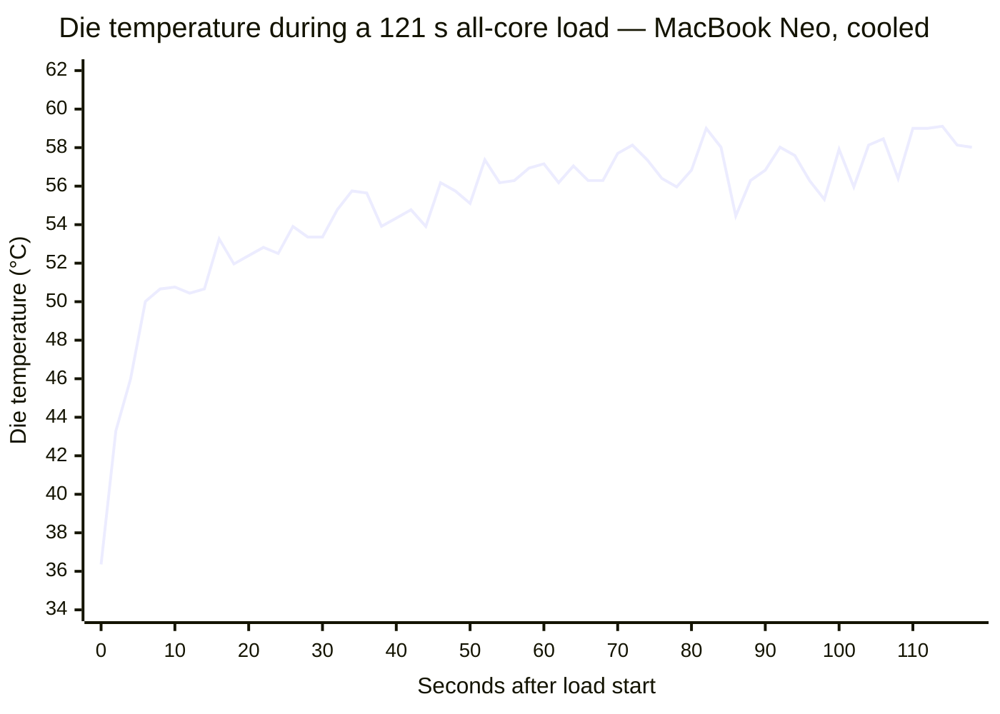
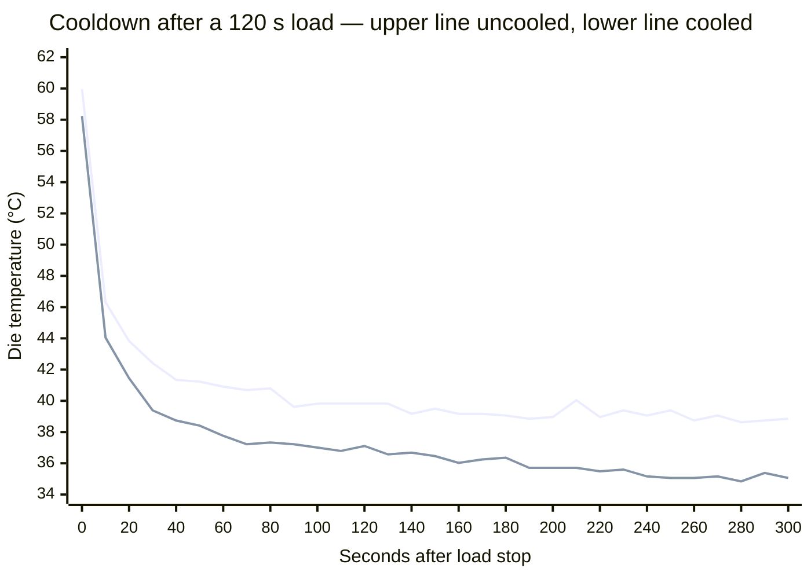

# MacBook Neo Thermal Behavior

Every timing benchmark is measured under some thermal condition, and the harness
tries to hold that condition constant so two runs are comparable. Doing that
requires knowing what the machine's thermal signals actually mean. On the
MacBook Neo they do not mean what their names suggest: the operating system's
thermal-pressure enum is not a temperature reading, and the die temperature that
would replace it is noisier than any of the thresholds one would reach for by
intuition.

This article records what we measured on that machine, with and without its
external cooler, and why the benchmark setup around it looks the way it does. It
is the detailed backing for the macOS row in
[Device conditions](device-conditions.md#per-device-we-measured).

The unit under test is thermally modified. See
[Measurement rig](#measurement-rig) before quoting any temperature from here.

## Key findings

**The thermal-pressure enum is not a temperature signal.** Despite its name,
`kOSThermalNotificationPressureLevelName` is an integrator with a fixed ~318 s
hold-off. It released at the identical sample after a 10 s load and a 123 s one,
and at the identical sample with the die at 34.84 °C and at 38.52 °C. It engaged
on a die change of 0.10 °C: one quantization step. Nothing thermal moves it.
This is the finding most likely to mislead, because the name promises otherwise.

**Idle die temperature is noisy enough to rule out intuitive thresholds.**
With no load at all the Neo's die wanders 3.8 °C peak-to-peak, σ ≈ 0.4 °C, and
the sensors quantize at 0.10 °C. A gate written as "within 1 °C of idle" is
asking for resolution the hardware does not have. The noise is also
autocorrelated, so averaging recovers far less than `√N` suggests.

**Heat arrives in seconds and leaves over minutes.** A 3.5 s unit heats the die
10–12.5 °C; shedding the last degree takes minutes across at least two thermal
time constants. Gating on a return to baseline therefore spends nearly all its
time in the slowest part of the curve.

**An external cooler changes the equilibrium temperature and almost nothing
else**: not the noise floor, not the cooling rate, not peak temperature, not
the enum. It is worth having as margin, not as speed. Note that the test unit
also carries a **passive internal thermal pad in both arms**, so "uncooled" here
is not a stock machine; see [Measurement rig](#measurement-rig).

**Across the temperature spread a batch actually produces, results do not
change.** That is why die temperature is recorded per repetition but not gated
on.

## Measurement rig

The device is a MacBook Neo (A18 Pro), which ships with **no internal fan**. The
unit under test is **modified in two independent ways**, and every number in
this article was measured on the modified machine:

1. **A passive thermal pad inside the case**, added to thermally couple the CPU
   and GPU to the chassis. This is always present (it cannot be toggled between
   runs), and it gives the SoC a far larger heat sink than it ships with.
2. **An external active cooling pad** clamped under the case. This is the only
   variable: **"cooled" and "uncooled" throughout this article mean with and
   without the *external* pad.** Both arms retain the internal one.

> **There is no stock-Neo data.** Neither arm represents a machine as shipped.
> The "uncooled" arm is a passively-but-substantially-improved machine, not a
> stock one, and a genuinely stock Neo would be expected to run hotter than
> anything reported here: plausibly hot enough to reach a throttling regime
> that neither arm approaches. Nothing in this article should be read as
> characterizing the product.

The internal pad is also the most likely explanation for several results below,
and it is worth holding in mind while reading them. Coupling the die to the
chassis adds a large, slow thermal mass in series with it, which fits the
**multi-timescale cooling** (a fast die-to-chassis constant followed by much
slower chassis-to-air ones), the **long baseline settling times**, and the fact
that the external pad moves the equilibrium by only 3.4 °C. It is cooling a
chassis that was already doing most of the work. That reading is inference from
the shape of the data, not something measured against an unmodified machine.

All measurements come from `tools/macos-thermal-probe`, which samples three
signals side by side:

- **`PMU tdie*` die temperature** via private IOKit sensors: the same path the
  iOS client uses. The Neo exposes 7 such sensors; the reported figure is the
  **maximum** across them.
- **`kOSThermalNotificationPressureLevelName`** via `notify_get_state`: the enum
  the readiness gate actually reads.
- **`ProcessInfo.thermalState`**: the coarser public enum, recorded for
  comparison.

Two properties of the temperature reading matter before any number below can be
interpreted. The sensors **quantize at 0.10 °C**, so that is a hard floor on
resolution. And because the figure is a *maximum over sensors*, it is
upward-biased and noisier than any single sensor would be, and not comparable
across hosts with different sensor counts.

### The contrast host

Several findings below are stated as a comparison against a **MacBook Pro
(M4 Max, 14 cores, internal fans, stock cooling, 20 `PMU tdie` sensors)**. It
appears throughout as *the contrast host*.

It is there because a single machine cannot tell you which of its properties are
properties of the *hardware class* and which are properties of *that machine*. A
threshold that looks sensible on one host is only demonstrably wrong once a
second host disagrees with it. The two chosen differ about as much as two Macs
can:

| | MacBook Neo (as tested) | Contrast host (MacBook Pro M4 Max) |
| --- | --- | --- |
| Internal cooling | no fan; passive pad added to chassis | fans, stock |
| `PMU tdie` sensors | 7 | 20 |
| Idle die noise, σ | ~0.4 °C | 0.26–0.41 °C |
| Thermal-pressure enum under load | reaches `moderate` | **never leaves `nominal`** |

That last row is the important one. The same readiness gate is uninformative on
both machines for **opposite reasons**: on the Neo the enum trips and stays
tripped, so the gate can never pass; on the contrast host it never trips at all,
so the gate passes instantly even at 60.4 °C under full load. Any rule derived
from one alone would look reasonable and be wrong on the other.

## Idle noise floor

The single most consequential number: **the Neo's die temperature wanders on its
own, with no load applied.**

Four 300 s idle baselines at 2 s sampling. A baseline counts as **settled** when
the total temperature change implied by its linear fit is smaller than its own
σ, that is, when the machine is genuinely idling rather than still coming to
rest from earlier work. The right-hand column is that ratio; above 1.0 the
measurement tool flags the baseline as drifting and every statistic derived from
it is suspect.

| Baseline | σ (raw) | σ (de-trended) | Lag-1 | Drift / 300 s | Drift ÷ σ |
| --- | --- | --- | --- | --- | --- |
| Cooled, settled | 0.43 °C | 0.426 °C | +0.07 | −0.25 °C | 0.6 ✓ |
| Cooled, settled: separate session, weeks apart | 0.80 °C | 0.799 °C | +0.68 | +0.20 °C | 0.3 ✓ |
| Uncooled, **still warming from cold** | 0.64 °C | 0.404 °C | +0.63 | +1.74 °C | **2.7 ✗** |
| Cooled, **still cooling from prior work** | 1.03 °C | 0.925 °C | +0.80 | −1.53 °C | **1.5 ✗** |

The first two rows are the trustworthy ones. The last two are included precisely
because they are not: they show what an unsettled baseline does to the numbers,
which is the most common way these measurements go wrong.

Peak-to-peak on a clean 300 s baseline was **3.79 °C** (35.92–39.71 °C) with the
machine doing nothing at all.

Three consequences follow.

**No fixed temperature threshold survives.** A gate written as "wait until the
die is within 1 °C of idle" is asking for a resolution the sensor does not have
on this machine. The contrast host is quieter (σ 0.26–0.41 °C), so a constant
tuned on one is wrong on the other, in the direction that silently breaks the
gate rather than loosening it.

**Averaging helps far less than it appears to.** The noise is autocorrelated:
lag-1 reached +0.92 at 0.25 s sampling, implying a correlation time of a few
seconds. For an AR(1) process the variance of a mean inflates by `(1+r)/(1-r)`,
so **eight samples taken over two seconds are worth about one independent
sample**. Sampling faster improves time resolution and nothing else.

**Idle noise is not a stable per-machine constant.** De-trended σ ranges
0.40–0.93 °C across the four baselines above, on one physical machine. Some of
that is drift (the two worst-behaved baselines were both flagged as still
settling), but not all: the cooled and session-A baselines are both clean by
that test and still differ twofold. Any calibration measured once should be
treated as provisional.

## Heating and cooling asymmetry

Heat arrives in seconds. It leaves over minutes. This is the property that
drives most of the setup decisions.

Die temperature across a 121 s all-core load, sampled every 2 s from a 36.4 °C
start. Most of the total rise happens in the first six seconds; the remaining
two minutes add about as much again, slowly and noisily:



| Time after load start | Die rise |
| --- | --- |
| 2 s | **+6.9 °C** |
| 4 s | +9.6 °C |
| 6 s | +13.7 °C |
| 8 s | +14.3 °C |
| 121 s | +23.1 °C (peak 59.8 °C) |

**A 3.5 s unit heats the die by roughly 10–12.5 °C**: about ten times the idle
noise floor. Thermal variation across an ungated batch is therefore real and
easily measurable, not an artifact.

Cooling does not mirror this. The first 300 s after the same load stops, sampled
every 10 s; upper trace uncooled, lower trace cooled:



The shape shows the phases plainly: a near-vertical drop of ~14 °C in the first
ten seconds, a visible knee around 30–60 s, then a long shallow tail where the
remaining degree or two takes minutes. Fitting the decay confirms at least two
thermal masses:

| Phase | Time constant |
| --- | --- |
| First ~20 s, bulk of the excursion | τ ≈ 15 s |
| Next ~20 s | τ ≈ 44 s |
| Approaching baseline | τ ≈ 55 s+ |

A small excursion sheds with τ ≈ 7.5 s; a large one takes minutes to give up its
last degree. Waiting for a return to *baseline* therefore spends almost all of
its time in the flattest part of that curve, buying the least temperature per
second waited.

Both traces also make the cooler's actual contribution visible: the two curves
have the **same shape**, offset vertically. The cooler is not draining heat
faster. It is holding a lower floor.

## Thermal-pressure enum as a timer

The macOS readiness gate proceeds when
`notify_get_state(kOSThermalNotificationPressureLevelName)` reads 0 (`nominal`).
**That enum is not a temperature signal.** It is an integrator with a fixed
hold-off, and three independent lines of evidence establish it.

**It releases at a fixed delay regardless of how much heat went in.** A 10 s
load and a 123 s load (a 12× difference) cleared 317 s and 318 s after load
stop respectively.

**It releases at a fixed delay regardless of the machine's temperature.**
Identical schedules run with and without the cooling pad:

| | External cooler ON | External cooler OFF |
| --- | --- | --- |
| Enum trips | 304 s | 304 s |
| Enum clears | 738 s (318 s after load stop) | 738 s (318 s after load stop) |
| **Die temperature when it cleared** | **34.84 °C** | **38.52 °C** |

Not approximately identical: the same sample. Two materially different thermal
states, one identical instant of release.

**It engages on a change too small to be a threshold crossing.** In one run the
transition from `nominal` to `moderate` occurred as the die moved from 43.72 °C
to 43.83 °C: a single 0.10 °C quantization step. No temperature threshold
crosses on one least-significant bit.

Two further behaviors matter for the setup:

- **Engagement is fast, release is slow.** The enum trips roughly 2.9–4 s after
  load start and holds for ~318 s. A single 3.5 s benchmark arms it for over
  five minutes.
- **Repeated work keeps it armed indefinitely.** Across a 15-repetition batch of
  3.5 s units with 30 s rests, **99 % of samples read non-nominal** and the enum
  never returned to `nominal` once. Each repetition re-arms the integrator well
  inside its own hold-off.

The practical consequence, **for a load heavy enough to trip it**, is severe: a
variant consisting of a warm-up plus five units behind six thermal gates trips
the enum on the first unit, and every gate after that cannot pass at all;
`nominal` never arrives while the batch is running, so each gate runs out the
deadline instead.

**Real workloads confirm this, and the two hosts diverge.** The measurements
above drove a synthetic all-core burn, which is more thermally aggressive than a
3.5 s inference unit, but a 14-cell soak of the actual benchmark reproduces the
same behavior where it matters:

| 14-cell soak | Thermal-pressure enum |
| --- | --- |
| MacBook Neo | goes to `moderate` and **stays there** for the rest of the soak |
| Contrast host (MacBook Pro M4 Max) | **never leaves `nominal`** |

So on the Neo the gate genuinely cannot pass mid-batch under real load, and on
the contrast host it passes unconditionally. The synthetic burn overstates
absolute temperatures, but it does not overstate the enum's behavior.

`ProcessInfo.thermalState` moved in lock-step with the notify level in both
directions in every run, so it is not an alternative signal: only a coarser
view of the same one.

Levels above `moderate` have never been observed on this hardware, including
uncooled at 60 °C peak. Four of the five pressure levels remain unexercised
against real silicon.

## Cooled versus uncooled

Three paired runs, identical schedules, with and without the *external* cooling
pad. The passive internal thermal pad is present in both arms:

| | External cooler ON | External cooler OFF |
| --- | --- | --- |
| Idle σ, de-trended | 0.426 °C | **0.404 °C** |
| Idle baseline drift over 300 s | −0.25 °C | **+1.74 °C** |
| Peak, 120 s all-core load | 58.2 °C | 60.0 °C |
| Idle equilibrium temperature | **35.0 °C** | **38.4 °C** |
| Rate of heat shedding | — | **the same** |
| Max pressure level reached | `moderate` | `moderate` |
| Batch start-temp spread, 15 reps | **0.82 °C** | **3.00 °C** |
| Rep-to-rep scatter (start / peak) | 0.10 / 0.46 °C | 0.11 / 0.51 °C |

The cooler changes **less than expected, and not what one would guess**:

- **Not the noise floor.** De-trended idle σ is identical. The apparent
  0.43 → 0.64 °C difference in raw σ was entirely the uncooled baseline still
  warming from cold.
- **Not peak temperature**, much: 1.7 °C under a sustained all-core load.
- **Not the rate of cooling.** Measured as excess over each arm's *own* settled
  point, the decay curves nearly overlay (t+20 s: +6.4 vs +5.4 °C; t+120 s:
  +2.1 vs +1.4 °C).
- **Not the enum**, by even one sample.
- **The equilibrium temperature**, by 3.4 °C. That is the whole effect.

One number invites misreading and is worth stating explicitly. Return-to-baseline
took roughly ten times longer uncooled, but **that is an equilibrium effect, not
a slower cooling rate.** The uncooled machine settles 3.4 °C higher, so a test
written as "return to the pre-load baseline temperature" is waiting for a
temperature that arm never reaches. Time to shed a given excess is the same in
both. Time to reach a given *absolute* temperature is much longer, or never.

The uncooled arm also takes far longer to become measurable at all: its 300 s
"idle" baselines were still warming by +1.7 to +2.8 °C, which is enough to
corrupt any statistic derived from them.

## Batch behavior

The real benchmark duty cycle per variant is a ~2 s I/O-bound load, a 3.5 s
warm-up, then **five** 3.5 s units, with a ~6 s break between sets and a
readiness gate before each unit.

The runs below deliberately do **not** replicate that. They are a probe
configuration (**fifteen** repetitions of a 3.5 s unit with **30 s** rests)
chosen to answer a question the real cycle cannot: *does repeated work reach a
stable temperature, and if so after how many repetitions?* Five repetitions are
too few to distinguish a plateau from a slow climb, so the count was raised to
fifteen. The rest was set to 30 s because a 10 s rest was measured to accumulate
heat without bound, so it could not have shown a plateau at any repetition
count. Nothing about the real benchmark was changed.

Fifteen repetitions, 3.5 s unit, 30 s rest:

| | External cooler ON | External cooler OFF |
| --- | --- | --- |
| Start temp, first repetition | 36.82 °C | 36.91 °C |
| Start temp, fifteenth repetition | 37.60 °C | 39.90 °C |
| Spread across all 15 | 0.82 °C | 3.00 °C |
| Systematic drift | +0.041 °C/rep | +0.159 °C/rep |

Neither arm reached a provably flat plateau within 15 repetitions, though the
cooled arm is close: its total drift across the batch is around 0.6 °C, against
3.00 °C spread uncooled.

**Whether any of this affects the reported numbers was measured directly, and
the answer is no.** Across the ~3 °C spread a batch produces, benchmark results
did not change measurably. A separate 14-cell soak on this host held 0.27 %
between-cell variation. Rep-to-rep scatter is also essentially identical cooled
and uncooled, so the cooler does not make individual results more repeatable.
it narrows the systematic drift across a batch.

## Consequences for benchmark setup

**Die temperature is recorded, not gated on.** It is captured per repetition as
`device_apple_soc_temp_c_before` / `_after`. It is not used as a gate because no
constant threshold survives both the Neo's noise floor and the quieter contrast
hosts, and because the variation it would control has been measured not to
affect results on this workload. Recording keeps the assumption under continuous
audit at no cost.

The recorded value is rounded to whole °C, so the sub-degree figures on this page
came from raw readings and cannot be re-derived from the column. That is a
deliberate trade: the column is 32-bit, and a fractional value read back through
a 64-bit float arrives as `46.79999923706055`, which reads as precision the
sensor never had. The effects the column still has to answer for (a batch drifting
warmer, two runs starting from different temperatures) are degrees, not tenths.
Re-measuring a tenth-of-a-degree effect means instrumenting the raw
`die_temp_max_c()` for that experiment.

**The deadline is 7 minutes, not 5.** The enum's ~318 s hold-off exceeds a
5-minute deadline. At the former deadline the gate did not merely over-wait; it
failed cells outright.

**The cooling pad stays, as margin rather than speed.** It buys no throughput (
nothing in the loop waits on cooling), and does not improve run-to-run
repeatability. What it buys is a 0.82 °C batch spread instead of 3.00 °C, which
is fourfold headroom on the very assumption the setup rests on, plus thermal room
if a workload gets heavier and a much faster route to a trustworthy idle
baseline.

**A cell may waive the thermal criterion.** `readiness = { skip_thermal = true }`
is available where thermal state has been established not to matter for that host
and workload. The load criterion still applies, and such results are not
comparable to gated ones.

## Limits of these findings

- **Workload-specific.** The ~60 °C ceiling is where *this* duty cycle settles,
  not a property of the machine. A longer or heavier job could reach a throttling
  regime this one never approaches, at which point temperature would start to
  matter and the reasoning above would need redoing.
- **Host-specific, in both directions.** The contrast host never leaves
  `nominal` even at full load, reaching 60.4 °C with the enum reading zero
  throughout. The same gate is useless on both machines for opposite reasons,
  and neither generalizes to the other.
- **`moderate` is not `nominal`.** The Neo sits permanently in a raised pressure
  state while benchmarking. Nothing here establishes that state is harmless:
  only that within it, a 3 °C swing does not move these numbers.
- **Single unit, and a modified one.** All of this is one physical machine,
  carrying a passive internal thermal pad in every run. **No measurement of a
  stock Neo exists**, so the temperature figures here (equilibrium, ceiling,
  peak, cooling constants) characterize this rig rather than the product. A
  stock unit would be expected to run hotter, and possibly to reach the
  throttling regime that makes the "temperature does not matter" finding stop
  holding. Anyone reasoning about fleet devices, or about a Neo that is not this
  one, should re-measure rather than inherit these numbers.
- **What does transfer across all three configurations** (stock aside) is the
  enum's behavior. It is a fixed timer on both sides of the external-cooler
  comparison and across a 12× load range, which is a software property rather
  than a thermal one, so it is the one finding not contingent on the rig.
- **Uncooled data is thinner.** The uncooled arm's baselines were still settling
  in every run, which is itself a finding but limits how precisely its
  steady-state figures can be quoted.
- **The load was synthetic.** Every heating, enum, and duty-cycle figure here
  came from an all-core floating-point burn, not from an inference workload of
  the same duration. It is an upper bound on what a real unit does thermally.
  Numbers describing the machine's *response* (noise floor, time constants,
  equilibrium, enum timer behavior) transfer; numbers describing *how hot a
  benchmark gets* should be re-measured against the real thing.

## Reproducing these measurements

`tools/macos-thermal-probe` reproduces everything above on a given host. It
derives its thresholds from the host's own measured noise rather than from
constants, and reports the derivation so the numbers can be audited.

```bash
cd tools/macos-thermal-probe
clang -O0 -framework Foundation -framework IOKit -o thermal-probe thermal-probe.m

# Idle noise floor — the prerequisite for interpreting anything else
./thermal-probe 300 0 60 2 1

# Single load and cooldown — enum timing, cooling curve, settling curve
./thermal-probe 300 120 60 2 <cores> 900 3600

# Repeated duty cycle — batch drift and convergence
./thermal-probe --cycle 15 --load 3.5 --rest 30 --interval 0.1 --baseline 300
```

Two cautions when running these. Watch for the `[DRIFT]` warning: a baseline
taken while the machine is still settling inflates every statistic derived from
it, and on an uncooled Neo 300 s of idle is not enough. And if using the
`THERMAL_PROBE_CALIB` cache, use a **separate file per physical configuration**.
it validates the sampling window but has no way to know the cooling changed.

The tool's own README carries the derivation details, the calibration mistakes
made along the way, and the reasoning behind each statistic it reports.

## Related

- [Device conditions](device-conditions.md): the readiness gate across all
  platforms, and the rig conditions each is held under.
- [End-to-end latency → System Readiness Control](end-to-end-latency.md#system-readiness-control):
  the full gate criteria and rationale.
- `crates/pipette-readiness/src/macos.rs`: the macOS gate implementation.
- `tools/macos-thermal-probe/README.md`: measurement tool and its methodology.
