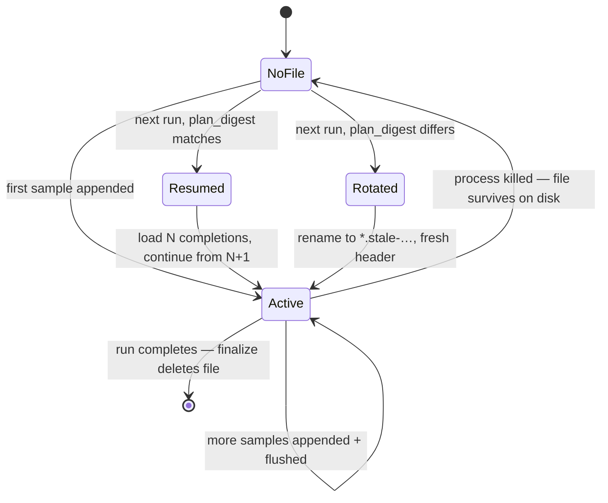

# Eval Checkpoint & Resume

Applies to **eval** benchmarks on the `pipette` CLI's llama.cpp, MLX and
torch-oai backends. OpenVINO does not implement eval, so it has no checkpoints.
Operator walkthrough: [usage.md](usage.md). Backend notes:
[llamacpp.md](llamacpp.md) · [mlx.md](mlx.md) · [torch-oai.md](torch-oai.md).

## Problem

A 5000-sample eval on a slow device can take hours. If the device
reboots, the user hits Ctrl-C, the OS OOM-kills the process, or the
runtime crashes, every completion produced so far is lost. The next
run starts at sample 0.

This feature persists each completed sample to disk as it's produced,
so the next invocation of the same benchmark skips finished samples
and picks up where the previous run stopped. Always on for eval
benchmarks: no flag to enable.

## Operator reference

Active checkpoints live at
`<workspace>/state/evals/<digest16>.jsonl`: the first 16 hex chars
of the run's `plan_digest`. Filenames do not carry the benchmark id;
that's in the header's `meta` block.

- **Audit what a checkpoint ran against**: `head -1 <file> | jq .meta`.
- **Progress after a kill**: `wc -l <file>` → completed samples =
  line count − 1.
- **Force a fresh run for one cell**: inspect files with
  `head -1 <file> | jq .meta` to find the match, then `rm` it.
- **Force a fresh run for every cell of a benchmark**:
  ```
  for f in .pipette/state/evals/*.jsonl; do
    id=$(head -1 "$f" | jq -r .meta.benchmark_id)
    [ "$id" = "MY_BENCH" ] && rm "$f"
  done
  ```
- **Clean stale (rotated) files**: `rm .pipette/state/evals/*.stale-*`.
- **Debug "my run started from sample 0 again"**: look for a sibling
  `*.stale-*` with a recent timestamp. If one exists, diff the two
  `meta` blocks. The differing field tells you what changed. If
  meta looks identical, the change was inside the benchmark
  definition or runtime flags (meta is decorative; the full input
  set lives in the digest). If no stale file exists, the previous
  run completed cleanly (file deleted on success) and there was
  nothing to resume.

## State model

**Two layers of resumability** exist in the pipeline. This feature
adds the inner one.

1. **Cell state** (owned by `pipette-plan`, unchanged here). Tracks
   each `(benchmark, model, runtime, flags)` cell as Missing /
   Running / Failed / Done. Lives on the **operator's machine** in
   the plan workspace. The plan runner decides which cells to execute
   or retry.
2. **Sample state** (this feature). Tracks completed samples produced
   within a single cell's eval run. Lives on the **target device** in
   the CLI workspace.

The two layers are on different machines and don't share storage.
Deleting one has no effect on the other.

```
Operator machine (where you run `pipette-plan run …`)
────────────────────────────────────────────────────────────
<plan-workspace>/.pipette-plan/
  plans/<plan_id>/state.jsonl          ← Layer 1: cell state

Target device (where the CLI actually runs the benchmark)
────────────────────────────────────────────────────────────
<cli-workspace>/.pipette/
  state/evals/
    <digest16>.jsonl                    ← Layer 2: sample state
    <digest16>.jsonl.stale-…            ← rotated sample state
```

**Identity.** Files are keyed by `plan_digest`: a SHA-256 over every
input that can influence generation (benchmark definition, runtime
flags, model identity, runtime identity). The first 16 hex chars
appear in the filename; the full digest appears in the header and is
the sole field compared on load. Two runs share state iff they
produce the same `plan_digest`.

**Repeated samples (`#k` ids).** Evals that repeat a prompt (e.g. IFBench
`2026.06.1`, scored pass@1 over 5 attempts) arrive as distinct salted sample
ids `<id>#0 … <id>#4`; the scoring service expands `metadata.repeats` at serve
time; the client sees them as ordinary, independent samples. Because the
checkpoint skip set is keyed on sample id, each `#k` attempt is tracked
separately: a resumed run skips the attempts already completed and draws fresh
completions only for the remaining `#k` ids. The repeats are sampled
(`temperature 0.6`, no seed), so a redrawn attempt is a new independent draw, not
a replay of the lost one, which is exactly what pass@1 wants. The digest is
unaffected: temperature is derived deterministically from the eval id, not a
flag, so it does not enter the digest as a separate input.

**File format.** Line 1 is a JSON header; lines 2+ are one completion
each.

```
{"plan_digest":"…","meta":{"benchmark_id":"eval_smoke","model_marker":"…","runtime_marker":"…"}}
{"id":"s0001","completion":"…"}
{"id":"s0002","completion":"…"}
…
```

`meta` carries benchmark id, model marker, and runtime marker in
plain text for `jq` inspection. It is **not validated**; only
`plan_digest` decides reusability. Timing info is intentionally not
stored: use `ls -l <file>` for last-write time and read the `<ts>`
from a stale sibling's filename for rotation time.

**Lifecycle.**



**Ownership.** Rust owns the header and the file's append-mode
handle: writes the header on open, deletes the file on finalize.
Llamacpp writes each completion line directly. MLX's Python child
receives the file path and the set of already-completed ids, appends
one completion line per sample with `flush() + fsync()`, and never
touches the header; Rust re-reads the file after Python exits as the
authoritative view. At any instant, exactly one process holds a
writable handle.

**Durability.** Per-sample writes are flushed before the next sample
starts: a clean kill loses at most the in-progress sample. Python
additionally `fsync`s because mid-eval hard kills are its primary
failure mode; Rust does not (acceptable for a resumable cache;
power-loss worst case is losing a handful of OS-cached writes).
`finalize()` is best-effort. A failed delete is harmless because
the next run finds every sample already persisted and re-finalizes.
A SIGKILL mid-write can leave a truncated trailing line; on load
it's skipped and that one sample is redone. An unparseable header
rotates the whole file as stale.

> **Warning: local runtime patches.** If you replace the runtime
> binary in `<workspace>/runtimes/…/` with a locally patched build
> (e.g. while debugging an inference change), the runtime marker
> stays the same and any prior checkpoint will silently resume
> against the new binary. Delete the active checkpoint before
> re-running.

## Resume triggers

A run resumes when the new invocation produces the same `plan_digest`
as the persisted file. Any input change produces a different digest
and the old file is rotated to `*.stale-<ts>-<pid>-<uuid>`.

| Input change | llamacpp | mlx | torch-oai |
|---|---|---|---|
| Benchmark definition edited | rotate | rotate | rotate |
| Runtime version / flavor / engine ref | rotate | rotate | rotate |
| `--runtime-flags` / resolved server flags | rotate | — | rotate |
| Vision mmproj (`gguf-vision://` / resolved path) | rotate | — | — |
| Model file overwrite (size/mtime changed) | rotate | — | — |
| `--model` ref → different file/repo | rotate | rotate | rotate |
| Runtime binary/venv rebuilt under same label | **no** | **no** | **no** |
| Workspace model snapshot swap, same model URI | n/a | **no** | **no** |
| Header line corrupt or file unreadable | rotate | rotate | rotate |

## Failed-sample markers (llamacpp eval only)

When `llama-server` crashes mid-`/completion` (#103, Windows
`STATUS_STACK_OVERFLOW` from `std::regex` tokenizer backtracking on
certain Qwen3.5 / gemma / LFM2 prompts), the eval loop appends a
failed-marked entry to the checkpoint, restarts the server, and
continues. No sidecar file; a normal completion serializes as today,
a failed record adds two fields:

```
{"plan_digest":"…","meta":{…}}
{"id":"s0001","completion":"…"}
{"id":"51cd2cdc9277","completion":"","failed":true,"failed_reason":"[2026-05-12T17:30:00Z] llama-server crashed mid-completion: exit signal: 11 (SIGSEGV)"}
{"id":"s0003","completion":"…"}
```

Pre-feature checkpoint files load cleanly via `#[serde(default)]`.

**Crash detection.** On `/apply-template` or `/completion` failure
the eval loop polls `child.try_wait()` for up to 500 ms. `Some(exit)`
means recoverable: append failed, restart, continue. `None` means a
still-alive server returned a transport error: propagated as before.

**Finalize.** Returns every persisted entry (completed and failed)
so the submission carries both. mgmt strips `failed` / `failed_reason`
at the DTO boundary before forwarding to `/score`, re-injects them
onto the per-sample warehouse rows, and stamps `samples_failed` onto
the per-run `eval_metadata` JSON. On disk:

- Any failed entries → file rewritten to header + failed-only so
  future runs against the same `plan_digest` skip the crashing
  samples. A `.jsonl` left in `state/evals/` after a successful run
  is itself the operator signal.
- No failed entries → file deleted.

**No guardrail.** No cell-level or consecutive-failure cap. The
loop keeps going regardless of how many samples crash. Aborting a
catastrophically-broken cell is mgmt/operator policy informed by
`samples_failed`, not the runtime's call.

**Signalling.** Four complementary channels:

1. **Live log**: `log::warn!` per crash with id, prompt prefix,
   exit status, stderr tail; end-of-cell summary with totals.
2. **Persisted extras**: `FAILED: …` block on
   `RunResponse.stderr`, lands in `result_extras_path` next to
   the result payload.
3. **Checkpoint file**: failed-only `.jsonl` survives finalize.
4. **mgmt warehouse**: per-sample `failed=true, failed_reason=…`
   plus per-run `eval_metadata.samples_failed`.

**Skip set.** The per-sample loop skips any id in the checkpoint,
completed or failed: `done_ids` is shared.

**Operator reference.**

- List failed entries: `jq -c 'select(.failed == true) | {id, failed_reason}' <file>`
- Un-skip after upstream fix: drop the failed line(s), or `rm` the
  file to reset the cell's skip state entirely.
- Audit a cell: `head -1 <file> | jq .meta`

## Plan interaction

The plan runner invokes the CLI once per cell with deterministic argv.
Identical inputs across retries produce an identical `plan_digest` →
sample-level resume works without the plan runner knowing about it.

- Device reboot mid-cell → transport error → plan re-queues → CLI
  respawns → checkpoint resumes.
- CLI crash → cell marked Failed → user reruns the plan → resume.
- Different cells of the same benchmark get different `plan_digest`s
  and therefore different files, so interrupting one cell does not
  rotate another cell's partial work.
